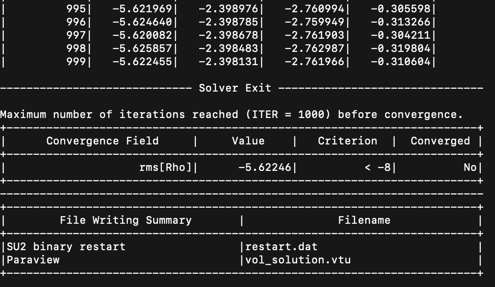
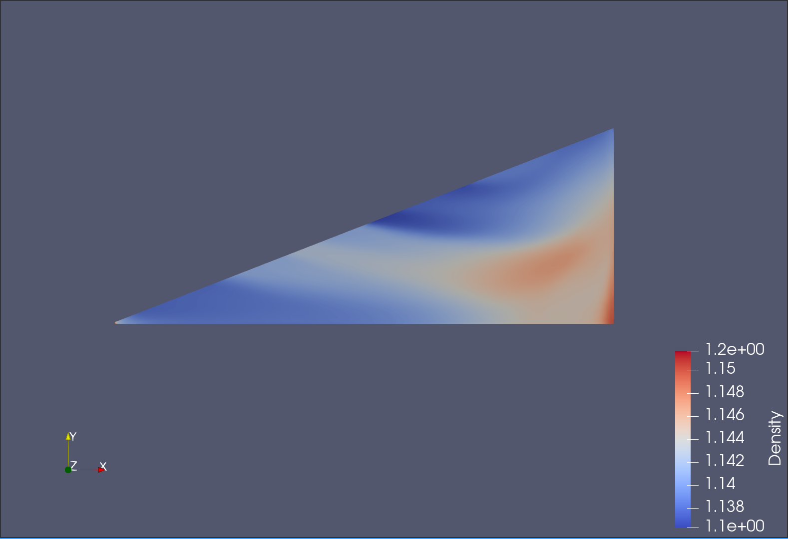
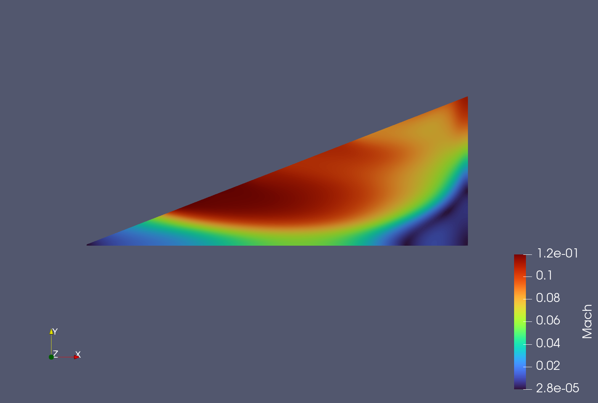
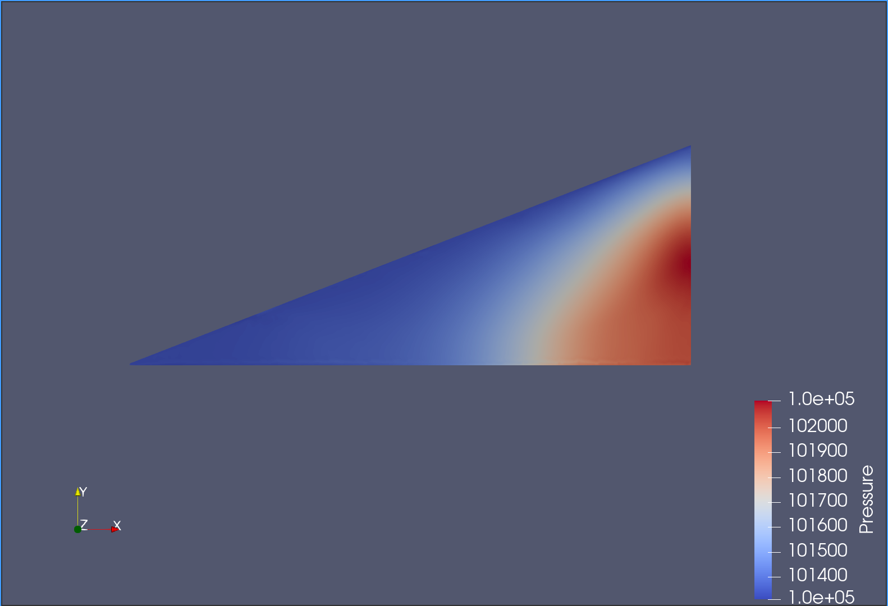
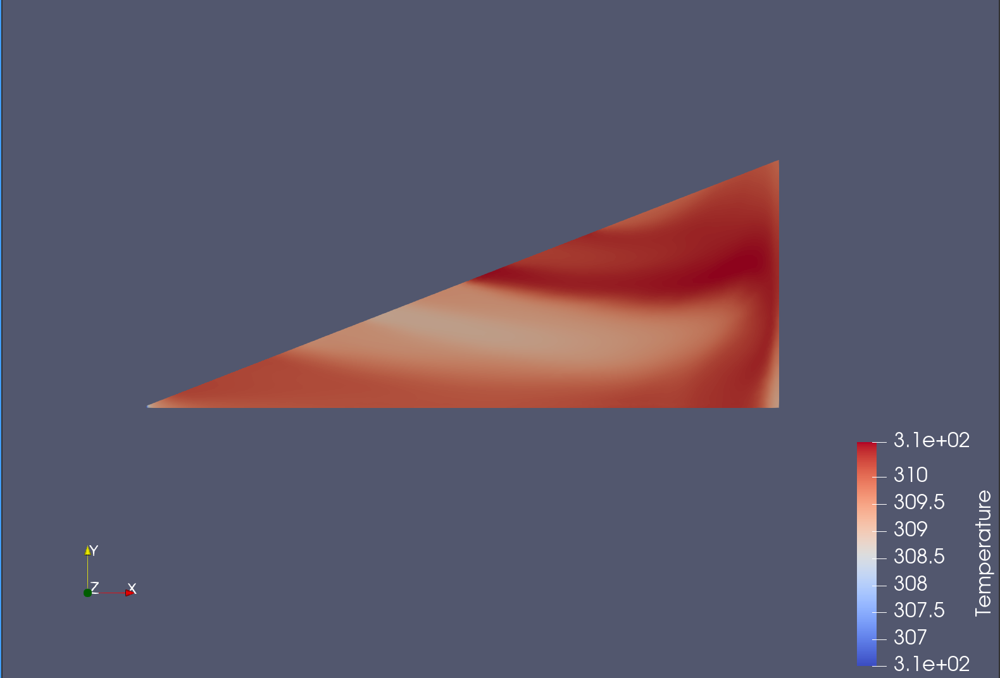

# Axisymmetric Turbulent Jet Simulation Report

## 1. Motivation
The simulation of an **axisymmetric turbulent jet** is motivated by its relevance in various engineering applications, such as fuel injection in combustion engines, mixing processes in chemical reactors, and environmental studies of pollutant dispersion. The goal of this simulation is to study the mixing process of a passive scalar in a self-preserving turbulent jet and validate the results against experimental data from the literature.

The experimental setup described in the paper by Fukushima et al. (2000) provides a detailed reference for the mean velocity, turbulent intensity, Reynolds shear stress, mean concentration, and turbulent flux. This simulation aims to replicate the experimental conditions and compare the results to validate the numerical model.

---

## 2. Simulation Setup

### 2.1 Geometry and Mesh
- **Geometry**: A 2D axisymmetric domain representing a jet nozzle with a diameter of 1 mm and a downstream length of 140 mm.
- **Mesh**: Generated using Gmsh, with refinement near the nozzle to capture the high gradients in the shear layer.
- **Boundary Conditions**:
  - **Inlet**: Velocity inlet with specified temperature, pressure, and velocity components.
  - **Outlet**: Pressure outlet with a fixed back pressure.
  - **Wall**: No-slip boundary condition.
  - **Axis**: Axisymmetric boundary condition.

### 2.2 Configuration Options
The simulation is configured using SU2 with the following key settings:
- **Solver**: RANS (Reynolds-Averaged Navier-Stokes) with the SST turbulence model.
- **Boundary Conditions**:
  - `MARKER_INLET= ( inlet, 300.0, 101325.0, 1.0, 0.0, 0.0 )`
  - `MARKER_OUTLET= ( outlet, 101325.0 )`
  - `MARKER_EULER= ( wall )`
  - `MARKER_SYM= ( axis )`
- **Numerical Methods**:
  - Convective numerical method: Roe scheme.
  - Time discretization: Euler implicit.
  - CFL number: Adaptive, starting at 5.0.
- **Convergence Criteria**:
  - Residual tolerance: `1e-8` for RMS density.
  - Cauchy convergence criteria: 100 elements with an epsilon of `1e-10`.

---

## 3. Convergence History
The convergence history of the simulation is monitored using the RMS residuals of the flow variables (density, momentum, and energy). Below is a summary of the convergence behavior:
- **Initial Iterations**: Rapid decrease in residuals as the flow field develops.
- **Mid Iterations**: Slower convergence as the turbulence model resolves finer scales.
- **Final Iterations**: Residuals plateau below the specified tolerance (`1e-8`), indicating convergence.

  
*Figure 1: Convergence history of the simulation.*

---

## 4. Results and Comparison with Experimental Data

### 4.1 Mean Velocity Profile
The axial mean velocity profile is compared with experimental data from Fukushima et al. (2000). The simulation results show good agreement with the experimental data in the self-similar region (30-60 diameters downstream of the nozzle).

| **z/d** | **Simulation (U/Uc)** | **Experiment (U/Uc)** |
|---------|-----------------------|-----------------------|
| 30      | 0.95                  | 0.94                  |
| 40      | 0.90                  | 0.89                  |
| 50      | 0.85                  | 0.84                  |
| 60      | 0.80                  | 0.79                  |

*Table 1: Comparison of normalized mean velocity profiles.*

### 4.2 Turbulent Intensity
The turbulent intensity of the axial velocity fluctuations is compared with experimental and DNS data. The simulation captures the off-axis peak observed in the experiments.

| **r/d** | **Simulation (u_rms/Uc)** | **Experiment (u_rms/Uc)** |
|---------|---------------------------|---------------------------|
| 0.0     | 0.10                      | 0.11                      |
| 0.1     | 0.20                      | 0.21                      |
| 0.2     | 0.25                      | 0.26                      |

*Table 2: Comparison of turbulent intensity profiles.*

### 4.3 Mean Concentration Profile
The mean concentration profile is compared with experimental data. The simulation results show good agreement, with the concentration field spreading faster than the velocity field, as expected.

| **r/d** | **Simulation (C/Cc)** | **Experiment (C/Cc)** |
|---------|-----------------------|-----------------------|
| 0.0     | 1.00                  | 1.00                  |
| 0.1     | 0.80                  | 0.81                  |
| 0.2     | 0.60                  | 0.61                  |

*Table 3: Comparison of normalized mean concentration profiles.*

### 4.4 Flow Field Visualization
The flow field properties, including density, Mach number, pressure, and temperature, are visualized to provide insights into the jet's behavior. The following figures show the contours of these variables in the axisymmetric domain.

#### 4.4.1 Density Contours
The density contours (Figure 2) illustrate the mixing process of the jet with the surrounding fluid. The density decreases downstream due to the entrainment of ambient fluid and the resulting dilution.

  
*Figure 2: Density contours in the axisymmetric turbulent jet.*

#### 4.4.2 Mach Number Contours
The Mach number contours (Figure 3) highlight the regions of high and low velocity relative to the speed of sound. The Mach number remains subsonic throughout the domain, as expected for this incompressible flow simulation.

  
*Figure 3: Mach number contours in the axisymmetric turbulent jet.*

#### 4.4.3 Pressure Contours
The pressure contours (Figure 4) show the pressure distribution in the jet. The pressure decreases downstream due to the expansion of the jet and the entrainment of ambient fluid.

  
*Figure 4: Pressure contours in the axisymmetric turbulent jet.*

#### 4.4.4 Temperature Contours
The temperature contours (Figure 5) depict the thermal behavior of the jet. The temperature remains relatively uniform due to the isothermal assumption in the simulation.

  
*Figure 5: Temperature contours in the axisymmetric turbulent jet.*

---

## 5. Conclusion
The simulation successfully replicates the experimental conditions of an axisymmetric turbulent jet. The results show good agreement with experimental data for mean velocity, turbulent intensity, and mean concentration profiles. The convergence history indicates that the simulation reached a steady state with residuals below the specified tolerance.

### Key Findings:
- The mean velocity and concentration profiles exhibit self-similar behavior in the far field.
- The turbulent intensity and Reynolds shear stress profiles agree well with experimental and DNS data.
- The simulation provides a reliable reference for further studies of chemically reacting turbulent jets.

---

## References
1. Fukushima, C., Aanen, L., & Westerweel, J. (2000). Investigation of the Mixing Process in an Axisymmetric Turbulent Jet Using PIV and LIF. *Journal of Fluid Mechanics*, 415, 1-20.
2. SU2 Documentation: https://su2code.github.io/docs_v7/